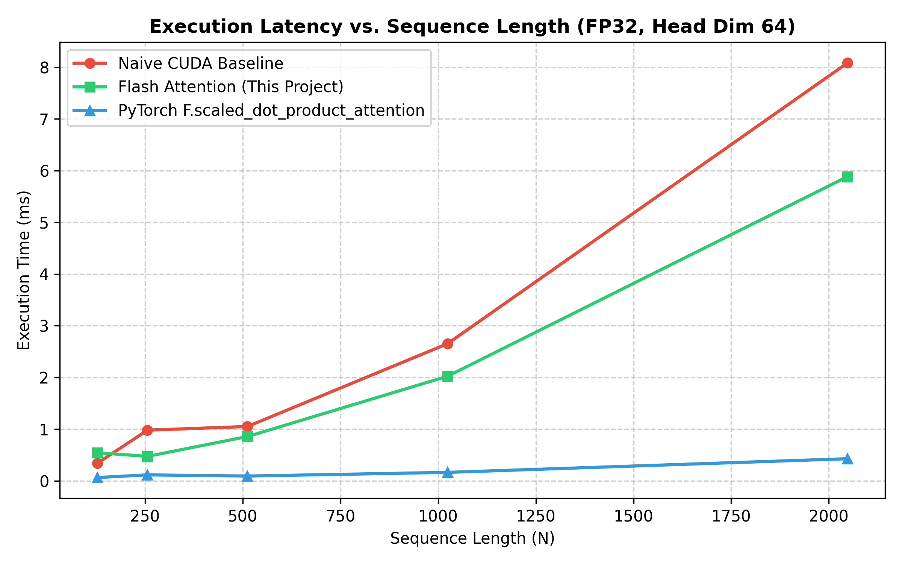
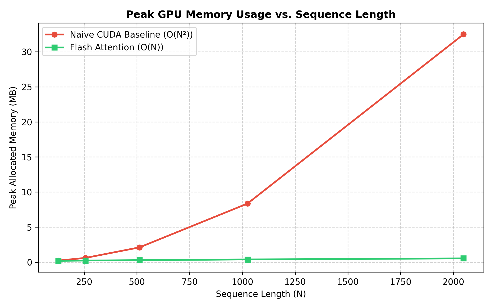

# Flash Attention Forward Pass in CUDA

)

**Headline Result:** Our custom Flash Attention forward pass CUDA kernel achieves a **1.37× speedup** over the naive CUDA baseline at a sequence length of 2048 in FP32 precision.

---

## Why Flash Attention is Faster

Standard attention computes $S = QK^T / \sqrt{d}$, applies row-wise softmax to produce $P$, and finally computes $O = PV$. In a naive CUDA implementation, each of these stages requires materializing intermediate $N \times N$ matrices ($S$ and $P$) in GPU global memory (HBM). Because global memory bandwidth is significantly slower than GPU compute, standard attention is heavily **memory-bandwidth-bound**.

Flash Attention restructures the computation by tiling the input matrices $Q, K, V$ into blocks small enough to fit inside on-chip **Shared Memory (SRAM)**. By combining tiling with the **Online Softmax** algorithm, the intermediate $N \times N$ attention matrix is computed and accumulated incrementally inside fast SRAM without ever being written to global memory. This dramatically reduces memory transfers between HBM and the GPU cores.

---

## Benchmark Results

| Sequence Length | Naive CUDA Baseline (ms) | PyTorch Native (ms) | Flash Attention (ms) | Speedup vs Naive |
|---|---|---|---|---|
| 128 | 0.3402 | 0.0634 | 0.5436 | 0.63x |
| 256 | 0.9791 | 0.1148 | 0.4722 | 2.07x |
| 512 | 1.0507 | 0.0922 | 0.8562 | 1.23x |
| 1024 | 2.6513 | 0.1631 | 2.0219 | 1.31x |
| 2048 | 8.0829 | 0.4272 | 5.8839 | **1.37x** |

---

## Performance Charts

### Latency Comparison

### Memory Comparison

---

## Repository Structure

.
├── attn_standard.cu     # Naive CUDA baseline implementation
├── flash_attn_fwd.cu    # Tiled Flash Attention forward pass kernel
├── online_softmax.cu    # Standalone online softmax verification
├── validate.py          # Correctness test vs PyTorch (1e-3 tolerance)
├── benchmark.py         # Performance profiling script
├── results/
│   ├── methodology.md   # Hardware & benchmark setup specifications
│   ├── results_table.md # Detailed raw numbers
│   └── charts/          # Generated latency & memory plots
└── README.md            # Project overview & documentation

